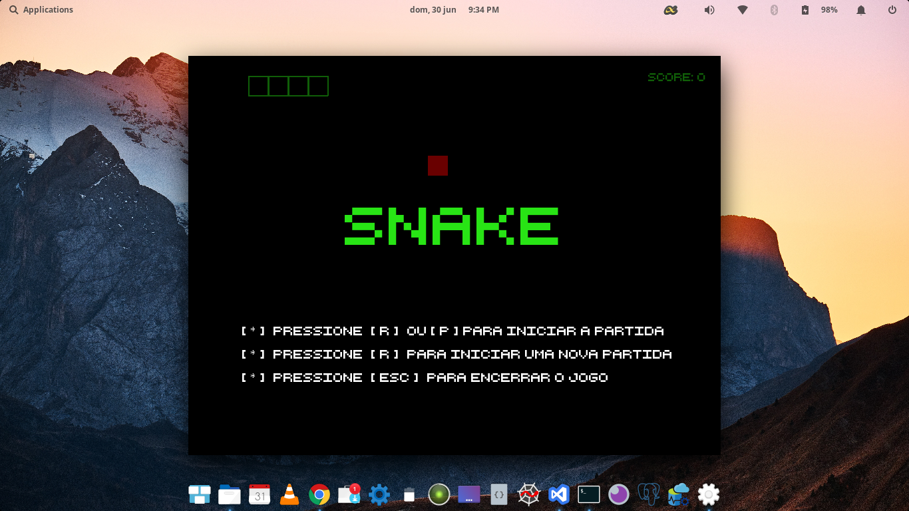
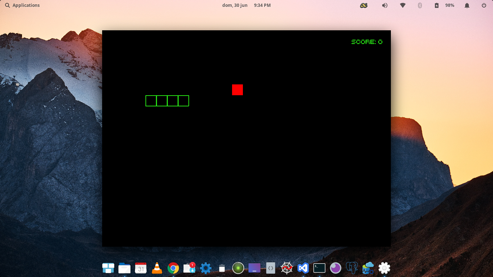
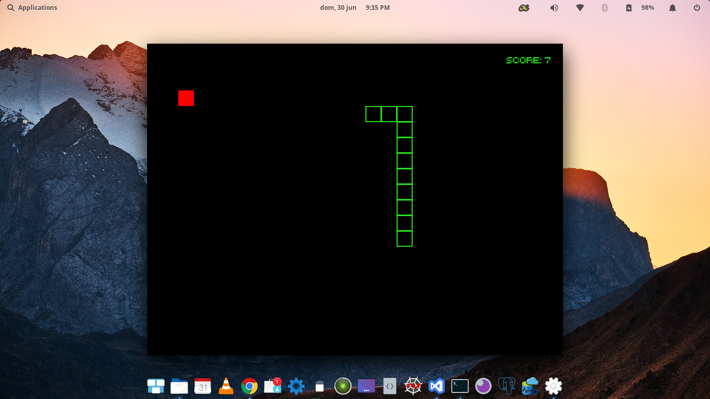
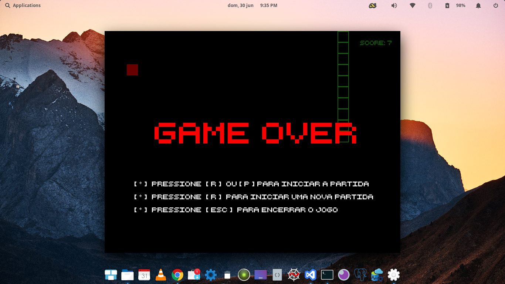

# Snake Game v 1.0

### Sumário
* Dependências
* Guia de Execução
* Screenshots

Um clone do clássico [Snake](https://en.wikipedia.org/wiki/Snake_(video_game_genre)) feito em python com a biblioteca [Pygame](https://www.pygame.org/wiki/about).

Tela inicial

## Dependências 
 * Testado em `Python 3.x` com `Pygame v1.9.6`

## Execução
Para executar basta seguir os comandos abaixo

* Abrir o terminal
* Instalar o Pygame com: `python3 -m pip install pygame`. Mais informações sobre a instalação
[aqui](https://www.pygame.org/wiki/GettingStarted#Pygame%20Installation).

* Fazer um clone deste repositório em sua máquina
* Entrar no repositório e executar: `python3 run.py`
* Dar uma estrelinha no Repositório.

## Screenshots

## Links
* Pygame - https://www.pygame.org/wiki/GettingStarted#Pygame%20Installation

* Python - https://python.org/

* Snake - https://en.wikipedia.org/wiki/Snake_(video_game_genre)
